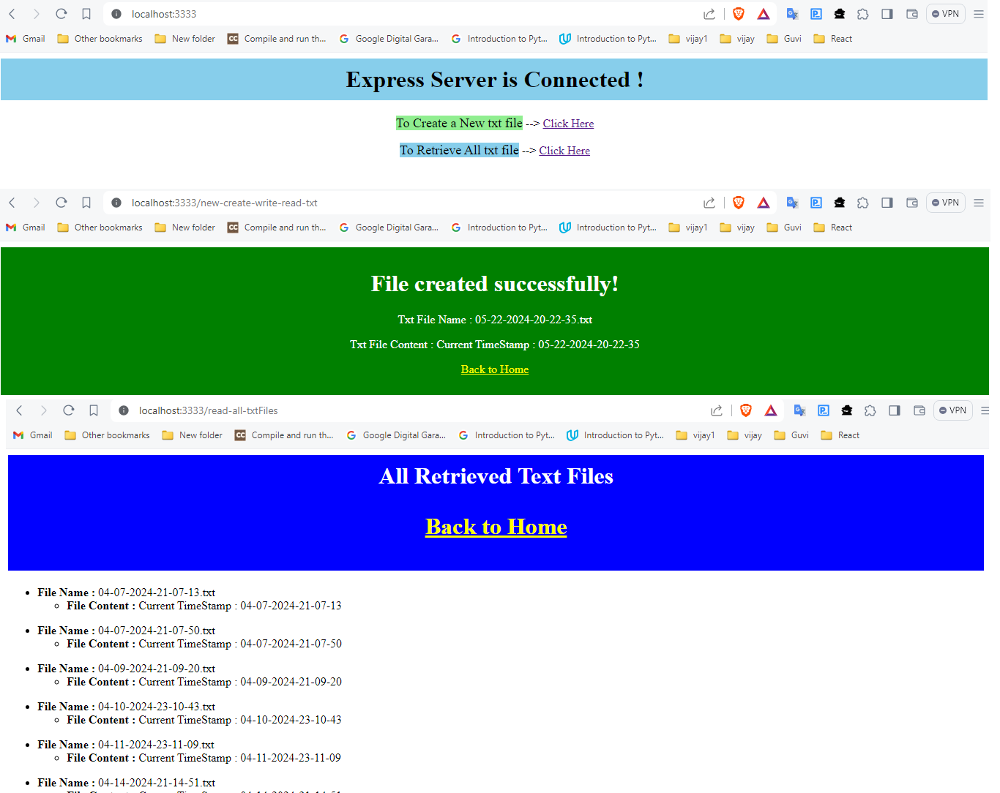

# NodeJS-FileSystem-Task

It's my first Backend Server/API task which was designed using node and express. It's Guvi-Zen class Roadmap session: Day-37 and Nodejs- Day -1 Task.

## Tech Stack

- fs
- NodeJs
- ExpressJS
- Nodemon
- date-fns
- postman

## Features

- Create new txt file and view all created txt files by just giving the API endpoints

## Lessons Learned

Through this task I learned to create express server and API endpoints. And also, I learned to use postman-API Testing Tool

## Testing Tool

I used Postman to test my api endpoints are working fine.

## Website

[NodeJS-FileSystem-Task](https://nodejs-filesystem-10e7.onrender.com/)

## API Documentation

[Click here to view API Documentation](https://documenter.getpostman.com/view/24200691/2sA2xcaacf)

## Screenshots

## Setup

Followig are the requirements to run this project:
- Node-Js
- Node Package Manager (NPM)

## npm run dev

Runs the app in the development mode.\
Open [http://localhost:3333](http://localhost:3333) to view it in your browser.

The page will reload when you make changes.\
You may also see any lint errors in the console.
